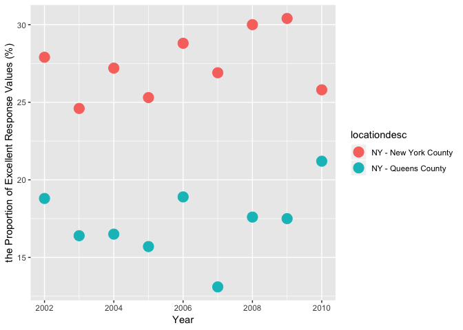

p8105\_hw2\_zw2541
================
Zixu\_Wang
9/30/2018

Problem 1
=========

Read and clean the data
-----------------------

``` r
transit_data = read_csv(file = "./data/NYC_Transit_Subway_Entrance_And_Exit_Data.csv") %>% 
  janitor::clean_names() %>% 
  select(line, station_name, station_latitude, station_longitude, route1:route11, entry, vending, entrance_type, ada) %>% 
  mutate(entry = ifelse(entry == "YES", TRUE, FALSE))
transit_data
```

    ## # A tibble: 1,868 x 19
    ##    line  station_name station_latitude station_longitu… route1 route2
    ##    <chr> <chr>                   <dbl>            <dbl> <chr>  <chr> 
    ##  1 4 Av… 25th St                  40.7            -74.0 R      <NA>  
    ##  2 4 Av… 25th St                  40.7            -74.0 R      <NA>  
    ##  3 4 Av… 36th St                  40.7            -74.0 N      R     
    ##  4 4 Av… 36th St                  40.7            -74.0 N      R     
    ##  5 4 Av… 36th St                  40.7            -74.0 N      R     
    ##  6 4 Av… 45th St                  40.6            -74.0 R      <NA>  
    ##  7 4 Av… 45th St                  40.6            -74.0 R      <NA>  
    ##  8 4 Av… 45th St                  40.6            -74.0 R      <NA>  
    ##  9 4 Av… 45th St                  40.6            -74.0 R      <NA>  
    ## 10 4 Av… 53rd St                  40.6            -74.0 R      <NA>  
    ## # ... with 1,858 more rows, and 13 more variables: route3 <chr>,
    ## #   route4 <chr>, route5 <chr>, route6 <chr>, route7 <chr>, route8 <int>,
    ## #   route9 <int>, route10 <int>, route11 <int>, entry <lgl>,
    ## #   vending <chr>, entrance_type <chr>, ada <lgl>

This dataset contains such variables: "line", "station name", "station latitude", "stantion longitude", "route1" to "route11", "entry", "vending", "entrance type" and "ADA compliance".

My data cleaning step:

-   Import the dataset
-   Clean the names
-   Select the variables I'm interested in
-   Use the ifelse function to convert the entry variable from character to a logical variable

This dataset contains 1868 rows and 19 columns. And these data are not tidy.

Questions
---------

-   How many distinct stations are there?

``` r
distinct_stations = distinct(transit_data, station_name, line, .keep_all = T) 
nrow(distinct_stations)
```

    ## [1] 465

There are 465 distinct stations.

-   How many stations are ADA compliant?

``` r
distinct_stations %>% 
  filter(ada == T) %>% 
  nrow()
```

    ## [1] 84

84 stations are ADA compliant.

-   What proportion of station entrances / exits without vending allow entrance?

If we only count the distinct stations, the propotion of station entrances / exits without vending allow entrance is

``` r
distinct_stations %>% 
  filter(vending == "NO", entry == "TRUE") %>% 
  nrow() / nrow(filter(transit_data, vending == "NO"))
```

    ## [1] 0.0273224

If we count all of the stations (different entrances of the same unique station as difference stations), the propotion of station entrances / exits without vending allow entrance is

``` r
transit_data %>% 
  filter(vending == "NO", entry == "TRUE") %>% 
  nrow() / nrow(filter(transit_data, vending == "NO"))
```

    ## [1] 0.3770492

Reformat data
-------------

``` r
reform_transit_data = transit_data %>% 
  gather(key = route_number, value = route_name, route1:route11) 
reform_transit_data
```

    ## # A tibble: 20,548 x 10
    ##    line  station_name station_latitude station_longitu… entry vending
    ##    <chr> <chr>                   <dbl>            <dbl> <lgl> <chr>  
    ##  1 4 Av… 25th St                  40.7            -74.0 TRUE  YES    
    ##  2 4 Av… 25th St                  40.7            -74.0 TRUE  YES    
    ##  3 4 Av… 36th St                  40.7            -74.0 TRUE  YES    
    ##  4 4 Av… 36th St                  40.7            -74.0 TRUE  YES    
    ##  5 4 Av… 36th St                  40.7            -74.0 TRUE  YES    
    ##  6 4 Av… 45th St                  40.6            -74.0 TRUE  YES    
    ##  7 4 Av… 45th St                  40.6            -74.0 TRUE  YES    
    ##  8 4 Av… 45th St                  40.6            -74.0 TRUE  YES    
    ##  9 4 Av… 45th St                  40.6            -74.0 TRUE  YES    
    ## 10 4 Av… 53rd St                  40.6            -74.0 TRUE  YES    
    ## # ... with 20,538 more rows, and 4 more variables: entrance_type <chr>,
    ## #   ada <lgl>, route_number <chr>, route_name <chr>

``` r
reform_distinct_stations = distinct_stations %>% 
  gather(key = route_number, value = route_name, route1:route11)
reform_distinct_stations
```

    ## # A tibble: 5,115 x 10
    ##    line  station_name station_latitude station_longitu… entry vending
    ##    <chr> <chr>                   <dbl>            <dbl> <lgl> <chr>  
    ##  1 4 Av… 25th St                  40.7            -74.0 TRUE  YES    
    ##  2 4 Av… 36th St                  40.7            -74.0 TRUE  YES    
    ##  3 4 Av… 45th St                  40.6            -74.0 TRUE  YES    
    ##  4 4 Av… 53rd St                  40.6            -74.0 TRUE  YES    
    ##  5 4 Av… 59th St                  40.6            -74.0 TRUE  YES    
    ##  6 4 Av… 77th St                  40.6            -74.0 TRUE  YES    
    ##  7 4 Av… 86th St                  40.6            -74.0 TRUE  YES    
    ##  8 4 Av… 95th St                  40.6            -74.0 TRUE  YES    
    ##  9 4 Av… 9th St                   40.7            -74.0 TRUE  YES    
    ## 10 4 Av… Atlantic Av…             40.7            -74.0 TRUE  YES    
    ## # ... with 5,105 more rows, and 4 more variables: entrance_type <chr>,
    ## #   ada <lgl>, route_number <chr>, route_name <chr>

-   How many distinct stations serve the A train?

``` r
reform_distinct_stations %>% 
  filter(route_name == "A") %>% 
  nrow()
```

    ## [1] 60

Therefore, 60 distinct stations serve the A train.

-   Of the stations that serve the A train, how many are ADA compliant?

``` r
reform_distinct_stations %>% 
  filter(route_name == "A", ada == "TRUE") %>% 
  nrow()
```

    ## [1] 17

Therefore, 17 of the stations that serve the A train are ADA compliant.

Problem 2
=========

Read and clean the data
-----------------------

-   Read and clean the Mr. Trash Wheel sheet.

``` r
wheel_data = read_excel("./data/HealthyHarborWaterWheelTotals2017-9-26.xlsx", sheet = 1, range = "A2:N258") %>% 
  janitor::clean_names() %>%
  filter(!is.na(dumpster)) %>% 
  mutate(sports_balls = as.integer(round(sports_balls, 0)))
wheel_data
```

    ## # A tibble: 215 x 14
    ##    dumpster month  year date                weight_tons volume_cubic_ya…
    ##       <dbl> <chr> <dbl> <dttm>                    <dbl>            <dbl>
    ##  1        1 May    2014 2014-05-16 00:00:00        4.31               18
    ##  2        2 May    2014 2014-05-16 00:00:00        2.74               13
    ##  3        3 May    2014 2014-05-16 00:00:00        3.45               15
    ##  4        4 May    2014 2014-05-17 00:00:00        3.1                15
    ##  5        5 May    2014 2014-05-17 00:00:00        4.06               18
    ##  6        6 May    2014 2014-05-20 00:00:00        2.71               13
    ##  7        7 May    2014 2014-05-21 00:00:00        1.91                8
    ##  8        8 May    2014 2014-05-28 00:00:00        3.7                16
    ##  9        9 June   2014 2014-06-05 00:00:00        2.52               14
    ## 10       10 June   2014 2014-06-11 00:00:00        3.76               18
    ## # ... with 205 more rows, and 8 more variables: plastic_bottles <dbl>,
    ## #   polystyrene <dbl>, cigarette_butts <dbl>, glass_bottles <dbl>,
    ## #   grocery_bags <dbl>, chip_bags <dbl>, sports_balls <int>,
    ## #   homes_powered <dbl>

-   Read and clean precipitation data for 2016.

``` r
precip_2016 = read_excel("./data/HealthyHarborWaterWheelTotals2017-9-26.xlsx", sheet = 4, range = "A2:B14") %>% 
  janitor::clean_names() %>% 
  filter(!is.na(total)) %>% 
  mutate(year = "2016")
```

-   Read and clean precipitation data for 2017

``` r
precip_2017 = read_excel("./data/HealthyHarborWaterWheelTotals2017-9-26.xlsx", sheet = 3, range = "A2:B14") %>% 
  janitor::clean_names() %>% 
  filter(!is.na(total)) %>% 
  mutate(year = "2017")
```

-   Combine datasets and convert month to a character variable

``` r
precip_data = bind_rows(precip_2016, precip_2017) %>% 
  mutate(month = month.name[month]) %>% 
  select(year, everything())
precip_data
```

    ## # A tibble: 20 x 3
    ##    year  month     total
    ##    <chr> <chr>     <dbl>
    ##  1 2016  January    3.23
    ##  2 2016  February   5.32
    ##  3 2016  March      2.24
    ##  4 2016  April      1.78
    ##  5 2016  May        5.19
    ##  6 2016  June       3.2 
    ##  7 2016  July       6.09
    ##  8 2016  August     3.96
    ##  9 2016  September  4.53
    ## 10 2016  October    0.62
    ## 11 2016  November   1.47
    ## 12 2016  December   2.32
    ## 13 2017  January    2.34
    ## 14 2017  February   1.46
    ## 15 2017  March      3.57
    ## 16 2017  April      3.99
    ## 17 2017  May        5.64
    ## 18 2017  June       1.4 
    ## 19 2017  July       7.09
    ## 20 2017  August     4.44

Describe the datasets
---------------------

The dataset "wheel\_data" contains the data from the first sheet of the "HealthyHarborWaterWheelTotals2017-9-26.xlsx" file. This data has 215 rows, 14 columns and 215 observations. Besides, this dataset has 14 variables. Taking "weight\_tons" as an example, dumpster1 collected 4.31 tons of trash on May 16th, 2014.

The dataset "precip\_data" combines the data from the third and forth sheet of the "HealthyHarborWaterWheelTotals2017-9-26.xlsx" file. This data has 20 rows, 3 colums and 20 observations. Besides, this dataset has 3 variables. For example, the total precipetation in January 2016 is 3.23.

Questions
---------

-   What was the total precipitation in 2017?

``` r
sum(precip_2017$total)
```

    ## [1] 29.93

The total precipitation in 2017 is 29.93.

-   What was the median number of sports balls in a dumpster in 2016?

``` r
median(filter(wheel_data, year == "2016")$sports_balls)
```

    ## [1] 26

In 2016, the median number of sports balls in a dumspter is 26.

Problem3
========

Read and clean the data
-----------------------

``` r
library(p8105.datasets)

data("brfss_smart2010")

brfss_smart2010_tidy = brfss_smart2010 %>% 
  janitor::clean_names() %>% 
  filter(topic == "Overall Health") %>% 
  select(-class, -topic, -question, -sample_size, -(confidence_limit_low:geo_location)) %>% 
  spread(key = response, value = data_value) %>% 
  janitor::clean_names() %>% 
  mutate(excellent_verygood = excellent + very_good)
brfss_smart2010_tidy
```

    ## # A tibble: 2,125 x 9
    ##     year locationabbr locationdesc excellent  fair  good  poor very_good
    ##    <int> <chr>        <chr>            <dbl> <dbl> <dbl> <dbl>     <dbl>
    ##  1  2002 AK           AK - Anchor…      27.9   8.6  23.8   5.9      33.7
    ##  2  2002 AL           AL - Jeffer…      18.5  12.1  32.7   5.9      30.9
    ##  3  2002 AR           AR - Pulask…      24.1  12.5  29.9   4.2      29.3
    ##  4  2002 AZ           AZ - Marico…      21.6  10.3  26.9   4.6      36.6
    ##  5  2002 AZ           AZ - Pima C…      26.6   7.5  31.9   3.9      30.1
    ##  6  2002 CA           CA - Los An…      22.7  14.3  28.7   4.5      29.8
    ##  7  2002 CO           CO - Adams …      21.2  14.4  29     4.2      31.2
    ##  8  2002 CO           CO - Arapah…      25.5   8    29.3   2.1      35.2
    ##  9  2002 CO           CO - Denver…      22.2  11.1  36.6   3        27.1
    ## 10  2002 CO           CO - Jeffer…      23.4  11.4  26.3   2.4      36.6
    ## # ... with 2,115 more rows, and 1 more variable: excellent_verygood <dbl>

Questions
---------

-   How many unique locations are included in the dataset? Is every state represented? What state is observed the most?

``` r
length(unique(brfss_smart2010_tidy$locationdesc))
```

    ## [1] 404

``` r
length(unique(brfss_smart2010_tidy$locationabbr))
```

    ## [1] 51

``` r
brfss_smart2010_tidy %>% 
  count(locationabbr) %>% 
  arrange(desc(n))
```

    ## # A tibble: 51 x 2
    ##    locationabbr     n
    ##    <chr>        <int>
    ##  1 NJ             146
    ##  2 FL             122
    ##  3 NC             115
    ##  4 WA              97
    ##  5 MD              90
    ##  6 MA              79
    ##  7 TX              71
    ##  8 NY              65
    ##  9 SC              63
    ## 10 CO              59
    ## # ... with 41 more rows

There are 404 unique locations included in the dataset. Every state is represented and NJ is observed the most.

\*In 2002, what is the median of the “Excellent” response value?

``` r
median(filter(brfss_smart2010_tidy, year == "2002")$excellent, na.rm = TRUE)
```

    ## [1] 23.6

In 2002, the median of the "Excellent" response value is 23.6

-   Make a histogram of “Excellent” response values in the year 2002.

``` r
brfss_smart2010_tidy %>% 
  filter(year == "2002") %>% 
  ggplot(aes(x = excellent)) + 
  geom_histogram()
```

    ## `stat_bin()` using `bins = 30`. Pick better value with `binwidth`.

    ## Warning: Removed 2 rows containing non-finite values (stat_bin).


-   Make a scatterplot showing the proportion of "Excellent" response values in New York County and Queens County (both in NY State) in each year from 2002 to 2010.

``` r
brfss_smart2010_tidy %>% 
  filter(locationdesc %in% c("NY - New York County", "NY - Queens County")) %>% 
  ggplot(aes(x = year, y = excellent, color = locationdesc)) + 
  geom_point(size = 5) +
  labs(x = "Year", y = "the Proportion of Excellent Response Values (%)")
```


